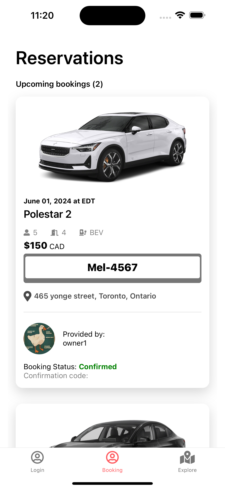
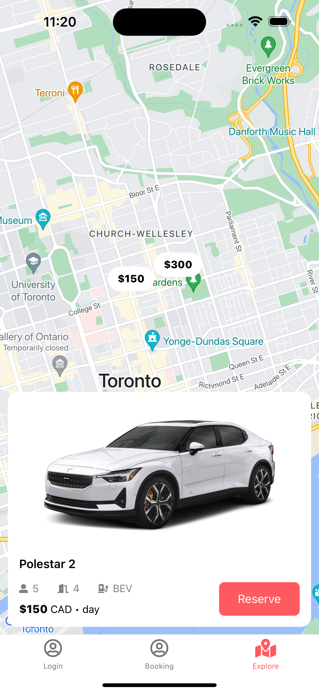
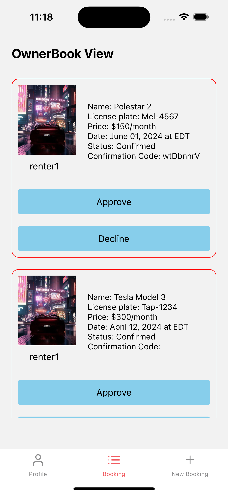
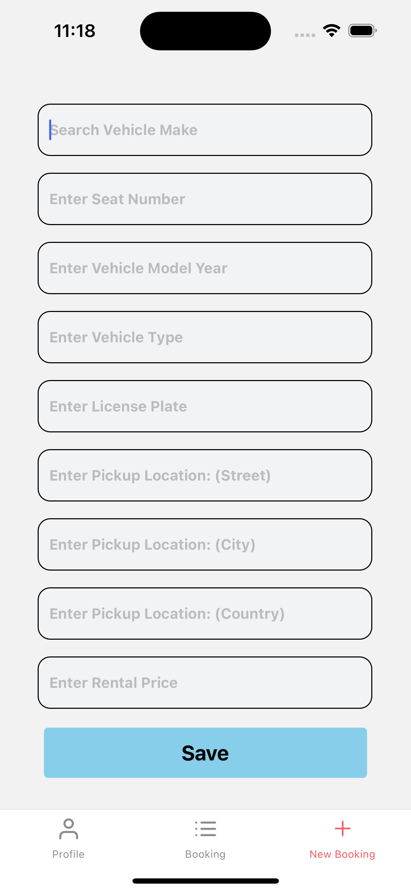

# Car Rental Application

This Repository consist of two **cross platform mobile applications**. For the owner app, they are allow to create account, create new booking, manage booking. For the renter app, user can explore the nearest car on map view, book a car

## Used Technology
- Language: React Native
- Database: Firestore
- Authentication: Firebase Auth

## Screenshot
### Renter

### Owner

